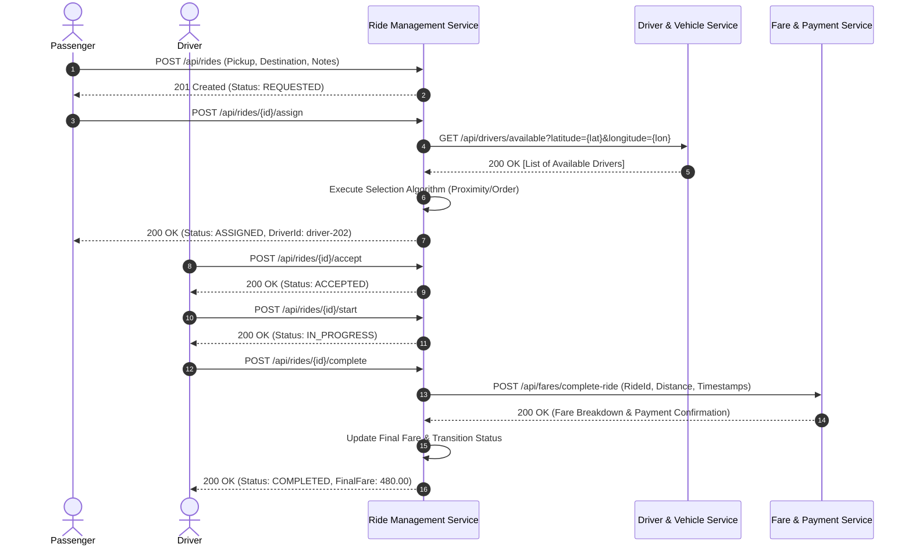

# RideLink — Ride Management Service

**Module**: IT3130 – Application Development  
**Assessment**: Group Assignment: RideLink (Backend Microservices Platform)  
**Assigned Service Owner**: Member 3 — Ride Management Service  
**Architecture**: Service-Oriented Backend Microservices (Spring Boot 3 + Java 17 + Spring Data MongoDB)

---

## 1. Service Purpose and Overview

The **Ride Management Service** is one of the four core backend microservices constituting the **RideLink** platform. It acts as the central business orchestrator for ride booking lifecycles, responsible for:
- Creating and storing passenger ride requests.
- Validating pickup and destination locations (GPS coordinates and place names).
- Maintaining the auditable, strictly validated ride lifecycle state machine.
- Communicating with the **Driver & Vehicle Service** to query nearby available drivers and deterministically assign the best candidate.
- Facilitating driver ride acceptance, pickup start, and trip completion.
- Communicating with the **Fare & Payment Service** upon trip completion to finalize billing calculations and record simulated payment.
- Managing ride cancellations within permitted states.
- Exposing secure RESTful APIs with fine-grained role-based access control (RBAC).

### Microservice Boundary Principles
To adhere strictly to microservice isolation rules:
- **No Direct Database Sharing**: This service connects exclusively to its dedicated MongoDB database (`ride_management_db`, collection `rides`). It never reads or writes directly to Account, Driver, or Payment databases.
- **Decoupled Identity & Authentication**: User registration, authentication, and token issuance belong solely to the **Account Service**. This service validates standard JWT bearer tokens issued by the Account Service via Spring Security Resource Server.
- **RESTful Interservice Integration**: All cross-service collaboration occurs via synchronous REST interfaces with configured timeouts, retry limits, and graceful error handling.

---

## 2. Technology Stack

| Component | Technology | Version / Specification |
| :--- | :--- | :--- |
| **Language** | Java (OpenJDK) | 17 (LTS) |
| **Framework** | Spring Boot | 3.2.5 |
| **Build Tool** | Apache Maven | 3.9+ / Maven Wrapper (`./mvnw`) |
| **Persistence** | Spring Data MongoDB | 4.2.5 (Mongo Driver 4.11.2) |
| **Security** | Spring Security & OAuth2 Resource Server | Nimbus JOSE JWT / HMAC-SHA256 |
| **Validation** | Jakarta Bean Validation | Hibernate Validator |
| **API Documentation** | Springdoc OpenAPI & Swagger UI | 2.5.0 (OpenAPI v3) |
| **HTTP Client** | Spring 6 `RestClient` | Configurable connection/read timeouts |
| **Testing** | JUnit 5, Mockito, Spring Boot Test, MockMvc | Automated unit, service & API tests |

---

## 3. Architecture and Interservice Communication

### Architecture Diagram
```
                     +-----------------------------------+
                     |       API Consumer / Client       |
                     |     (Postman / Swagger UI)        |
                     +-----------------+-----------------+
                                       |
                               Bearer JWT Auth
                                       v
                     +-----------------------------------+
                     |     Ride Management Service       |
                     |         (Port: 8083)              |
                     +--------+------------------+-------+
                              |                  |
              1. GET Available Drivers   2. POST Finalize Fare & Pay
                              |                  |
                              v                  v
                 +----------------------+  +---------------------+
                 |   Driver & Vehicle   |  |   Fare & Payment    |
                 |       Service        |  |       Service       |
                 |     (Port: 8082)     |  |    (Port: 8084)     |
                 +----------------------+  +---------------------+
                              |                  |
                       [Driver Mongo DB]  [Payment Mongo DB]
```

### Sequence Flow: End-to-End Ride Lifecycle



---

## 4. Ride Status State Machine

The service enforces strict lifecycle transitions. Arbitrary client updates are forbidden. Every state transition is executed through dedicated REST actions.

```
       +-------------+
       |  REQUESTED  |
       +------+------+
              |
      +-------+-------+
      |               |
      v               v
+----------+    +-----------+
| ASSIGNED |    | CANCELLED |
+-----+----+    +-----------+
      |               ^
      |               | (Cancellation permitted)
      v               |
+----------+----------+
| ACCEPTED |
+-----+----+
      |
      v
+-------------+
| IN_PROGRESS |
+-----+-------+
      |
      v
+-----------+
| COMPLETED | (Terminal State - no transitions allowed)
+-----------+
```

### Transition Matrix
| Current State | Target State | Permitted Endpoint | Allowed Actor(s) | Pre-conditions |
| :--- | :--- | :--- | :--- | :--- |
| *None* | `REQUESTED` | `POST /api/rides` | `ROLE_PASSENGER` | Valid pickup, destination coordinates |
| `REQUESTED` | `ASSIGNED` | `POST /api/rides/{id}/assign` | `ROLE_PASSENGER`, `ROLE_ADMIN` | At least 1 available driver found in DVS |
| `REQUESTED` | `CANCELLED` | `POST /api/rides/{id}/cancel` | `ROLE_PASSENGER`, `ROLE_ADMIN` | Non-blank cancellation reason |
| `ASSIGNED` | `ACCEPTED` | `POST /api/rides/{id}/accept` | `ROLE_DRIVER`, `ROLE_ADMIN` | Driver identity must match assigned `driverId` |
| `ASSIGNED` | `CANCELLED` | `POST /api/rides/{id}/cancel` | Passenger, Assigned Driver, Admin | Non-blank cancellation reason |
| `ACCEPTED` | `IN_PROGRESS` | `POST /api/rides/{id}/start` | `ROLE_DRIVER`, `ROLE_ADMIN` | Driver identity must match assigned `driverId` |
| `ACCEPTED` | `CANCELLED` | `POST /api/rides/{id}/cancel` | Passenger, Assigned Driver, Admin | Non-blank cancellation reason |
| `IN_PROGRESS` | `COMPLETED` | `POST /api/rides/{id}/complete` | `ROLE_DRIVER`, `ROLE_ADMIN` | Successful response from Fare & Payment Service |
| `COMPLETED` | *Any* | *None* | *None* | Terminal state. Any transition attempt returns `409 Conflict` |
| `CANCELLED` | *Any* | *None* | *None* | Terminal state. Any transition attempt returns `409 Conflict` |

---

## 5. Driver Assignment Algorithm

When driver assignment is invoked (`POST /api/rides/{id}/assign`):
1. **Verification**: Verifies that the ride exists, is in `REQUESTED` status, and that the requester is the ride owner or an admin.
2. **Proximity Query**: Calls `DriverServiceClient.getEligibleAvailableDrivers(lat, lon)` targeting the Driver & Vehicle Service.
3. **Empty Handling**: If the driver service returns zero drivers, the service throws `NoDriverAvailableException` (mapped to HTTP `409 Conflict`) without altering the ride status.
4. **Deterministic Selection**:
   - If distance metrics are provided by the Driver Service, candidate drivers are sorted in ascending order of distance (`min(distanceKm)`).
   - If distance metrics are absent, the first available eligible driver is selected deterministically.
5. **Atomic Transition**:
   - Persists `driverId` into the ride document.
   - Updates status to `ASSIGNED`.
   - Records UTC `assignedAt` timestamp.

---

## 6. Security and Role-Based Authorization

The service enforces stateless authorization using **Spring Security OAuth2 Resource Server**:
- **Token Format**: Standard JSON Web Tokens (JWT).
- **Identity Extraction**: The user identity is extracted from the `sub` claim (or `userId`). Identity cannot be spoofed by passing arbitrary IDs in the request body.
- **Role Conversion**: Roles from JWT claims (`roles`, `role`, `authorities`, or `realm_access.roles`) are mapped to Spring Security Granted Authorities (`ROLE_PASSENGER`, `ROLE_DRIVER`, `ROLE_ADMIN`).
- **Granular Ownership Checks**:
  - A passenger can only query their own rides (`/api/rides/{id}`, `/api/rides/passenger/{id}`).
  - Only the driver assigned to a specific ride can accept, start, or complete that ride.
  - A user cannot cancel another user's ride unless they are the assigned driver or possess `ROLE_ADMIN`.

---

## 7. Data Model and MongoDB Persistence

The service stores data in MongoDB (`ride_management_db`, collection `rides`).

### Ride Document Structure
```json
{
  "_id": "550e8400-e29b-41d4-a716-446655440000",
  "passengerId": "passenger-101",
  "driverId": "driver-202",
  "pickup": {
    "placeName": "University Entrance, Colombo 03",
    "latitude": 6.9022,
    "longitude": 79.8612
  },
  "destination": {
    "placeName": "Colombo Fort Railway Station",
    "latitude": 6.9344,
    "longitude": 79.8500
  },
  "status": "COMPLETED",
  "requestedAt": "2026-09-29T10:15:30Z",
  "assignedAt": "2026-09-29T10:16:00Z",
  "acceptedAt": "2026-09-29T10:16:45Z",
  "startedAt": "2026-09-29T10:20:00Z",
  "completedAt": "2026-09-29T10:45:00Z",
  "cancelledAt": null,
  "cancellationReason": null,
  "estimatedFare": 450.00,
  "finalFare": 480.00,
  "distanceKm": 4.2,
  "notes": "Please call on arrival at gate 2",
  "createdAt": "2026-09-29T10:15:30Z",
  "updatedAt": "2026-09-29T10:45:00Z"
}
```

### Indexed Fields
- `passengerId`: Optimizes passenger ride history lookups.
- `driverId`: Optimizes driver ride history lookups.
- `status`: Optimizes operational queries for active rides.
- `requestedAt`: Enables chronological pagination and sort order.

---

## 8. REST API Reference

| Method | Endpoint | Role(s) | Description | Success Code |
| :--- | :--- | :--- | :--- | :--- |
| `POST` | `/api/rides` | `ROLE_PASSENGER`, `ROLE_ADMIN` | Create a new ride request | `201 Created` |
| `GET` | `/api/rides/{rideId}` | Passenger owner, Assigned Driver, Admin | Get single ride by ID | `200 OK` |
| `GET` | `/api/rides/my` | Authenticated | Retrieve authenticated user's rides | `200 OK` |
| `GET` | `/api/rides/passenger/{passengerId}` | That Passenger, Admin | Get all rides for a passenger | `200 OK` |
| `GET` | `/api/rides/driver/{driverId}` | That Driver, Admin | Get all rides for a driver | `200 OK` |
| `POST` | `/api/rides/{rideId}/assign` | `ROLE_PASSENGER`, `ROLE_ADMIN` | Assign eligible driver via DVS | `200 OK` |
| `POST` | `/api/rides/{rideId}/accept` | `ROLE_DRIVER`, `ROLE_ADMIN` | Assigned driver accepts ride | `200 OK` |
| `POST` | `/api/rides/{rideId}/start` | `ROLE_DRIVER`, `ROLE_ADMIN` | Driver starts the trip | `200 OK` |
| `POST` | `/api/rides/{rideId}/complete` | `ROLE_DRIVER`, `ROLE_ADMIN` | Driver completes trip & finalizes fare | `200 OK` |
| `POST` | `/api/rides/{rideId}/cancel` | Passenger, Driver, Admin | Cancel ride in permitted state | `200 OK` |

---

## 9. Environment Variables and Configuration

Configuration is externalized using environment variables with safe defaults:

| Variable | Default Value | Description |
| :--- | :--- | :--- |
| `PORT` | `8083` | HTTP port for the Ride Management Service |
| `MONGODB_URI` | `mongodb://localhost:27017/ride_management_db` | Connection string for MongoDB database |
| `JWT_SECRET_KEY` | *(256-bit dev key)* | Secret key used for HMAC-SHA256 JWT verification |
| `DRIVER_SERVICE_BASE_URL` | `http://localhost:8082` | Base URL of Driver & Vehicle Service |
| `DRIVER_SERVICE_CONNECT_TIMEOUT_MS`| `3000` | Connection timeout for Driver service calls |
| `DRIVER_SERVICE_READ_TIMEOUT_MS` | `5000` | Read timeout for Driver service calls |
| `FARE_PAYMENT_SERVICE_BASE_URL` | `http://localhost:8084` | Base URL of Fare & Payment Service |
| `FARE_PAYMENT_SERVICE_CONNECT_TIMEOUT_MS`| `3000` | Connection timeout for Payment service calls |
| `FARE_PAYMENT_SERVICE_READ_TIMEOUT_MS` | `5000` | Read timeout for Payment service calls |

Refer to `.env.example` in the project root for template values.

---

## 10. How to Build, Test, and Run

### Prerequisites
- **Java 17 (JDK 17)**: Installed and configured on `PATH`.
- **MongoDB**: Running locally on port `27017` (or configured via `MONGODB_URI`).
- **Apache Maven 3.9+** (or use included `./mvnw` / `mvnw.cmd`).

### 1. Run Automated Test Suite
```bash
# Using Maven Wrapper (Windows PowerShell)
.\mvnw.cmd clean test

# Using standard Maven
mvn clean test
```
The test suite runs 74 comprehensive tests across domain models, state machines, business services, HTTP clients, and MockMvc controllers.

### 2. Run the Microservice Locally
```bash
# Using Maven Wrapper
.\mvnw.cmd spring-boot:run

# Or run the packaged JAR
.\mvnw.cmd package -DskipTests
java -jar target/ride-management-service-1.0.0.jar
```

### 3. Access Swagger UI / OpenAPI Documentation
Once started, open your browser:
- **Swagger UI**: [http://localhost:8083/swagger-ui.html](http://localhost:8083/swagger-ui.html)
- **OpenAPI v3 Spec (JSON)**: [http://localhost:8083/v3/api-docs](http://localhost:8083/v3/api-docs)

---

## 11. Testing and Demonstration Guide

### A. Demonstration using Postman
1. Open Postman.
2. Click **Import** and select:
   - `postman/RideLink_Ride_Management_Service.postman_collection.json`
   - `postman/RideLink_Local.postman_environment.json`
3. Select the `RideLink - Local Environment`.
4. Run requests in sequence under `1. Ride Lifecycle Operations`. The tests automatically extract `rideId` and `driverId` and populate subsequent steps.

### B. Example cURL Commands

#### 1. Create a Ride Request
```bash
curl -X POST "http://localhost:8083/api/rides" \
  -H "Authorization: Bearer <PASSENGER_JWT>" \
  -H "Content-Type: application/json" \
  -d '{
    "pickup": {
      "placeName": "University Main Gate",
      "latitude": 6.9022,
      "longitude": 79.8612
    },
    "destination": {
      "placeName": "Colombo Fort Station",
      "latitude": 6.9344,
      "longitude": 79.8500
    },
    "notes": "Near pedestrian crossing",
    "estimatedFare": 450.00,
    "distanceKm": 4.2
  }'
```

#### 2. Assign Driver to Ride
```bash
curl -X POST "http://localhost:8083/api/rides/<RIDE_ID>/assign" \
  -H "Authorization: Bearer <PASSENGER_JWT>"
```

#### 3. Accept Ride (Driver)
```bash
curl -X POST "http://localhost:8083/api/rides/<RIDE_ID>/accept" \
  -H "Authorization: Bearer <DRIVER_JWT>"
```

#### 4. Start Ride (Driver)
```bash
curl -X POST "http://localhost:8083/api/rides/<RIDE_ID>/start" \
  -H "Authorization: Bearer <DRIVER_JWT>"
```

#### 5. Complete Ride (Driver)
```bash
curl -X POST "http://localhost:8083/api/rides/<RIDE_ID>/complete" \
  -H "Authorization: Bearer <DRIVER_JWT>"
```

#### 6. Cancel Ride
```bash
curl -X POST "http://localhost:8083/api/rides/<RIDE_ID>/cancel" \
  -H "Authorization: Bearer <USER_JWT>" \
  -H "Content-Type: application/json" \
  -d '{
    "reason": "Passenger change of plans"
  }'
```

---

## 12. Negative Scenarios & Error Handling

All error responses return a standardized, secure structure:
```json
{
  "timestamp": "2026-09-29T10:30:00Z",
  "status": 409,
  "error": "RIDE_STATE_CONFLICT",
  "message": "Cannot start ride because its current status is REQUESTED",
  "path": "/api/rides/550e8400-e29b-41d4-a716-446655440000/start"
}
```

### Handled Negative Scenarios:
1. **Invalid Input (400 Bad Request)**: Missing pickup/destination, out-of-range coordinates (`latitude > 90`), or blank cancellation reason.
2. **Missing Resource (404 Not Found)**: Querying a non-existent `rideId`.
3. **No Driver Available (409 Conflict)**: When Driver Service returns zero available drivers in the pickup area.
4. **Invalid State Transition (409 Conflict)**: Attempting to complete a ride directly from `REQUESTED`, or cancelling a `COMPLETED` ride.
5. **Unauthorized Access (403 Forbidden)**: A passenger attempting to accept or start a ride, or viewing another user's ride history.
6. **External Service Failure (502 / 503)**: Handled gracefully if peer services time out or return errors without corrupting the local database state.

---

## 13. Academic Integrity and Assumptions

- **Independent Implementation**: This service has been designed and implemented solely as the Ride Management Service for RideLink.
- **Peer Service Interfaces**: Peer services (Driver & Vehicle Service on port `8082`, Fare & Payment Service on port `8084`) are integrated via clean client interfaces (`DriverServiceClient`, `FarePaymentServiceClient`). Their endpoints and request/response DTOs follow standard REST contracts and can be connected seamlessly in the group integrated environment.
- **Security Key**: In development and automated tests, an HMAC-SHA256 secret key is configured via `JWT_SECRET_KEY`. In production, this can be swapped with the Account Service's JWK set endpoint or public certificate without modifying business logic.
